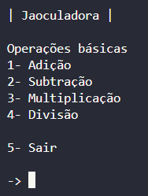
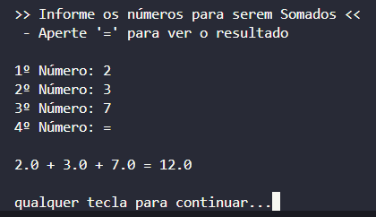
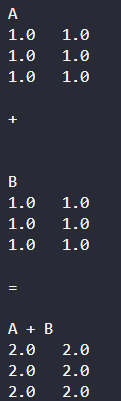

# Jaoculadora
é um projeto inicial para realizar operações matemáticas simples, com o objetivo de integrar Python e C++:

- Os menus e entradas do usuário são feitos em Python
- Os cálculos são realizados por funções escritas em C++

## Funcionalidades
- Atualmente o projeto oferece:
    - Adição
    - Subtração
    - Multiplicação
    - Divisão
    - Adição de Matrizes
    - Subtração de Matrizes
    - Multiplicação de Matriz por um único multiplicador

## Requisitos
- Python 3.12.10 ou superior
- Compilador C++ 64bits
- IDE

## Instalação e inicialização do programa
- Compile o arquivo basic_calc.cpp

1. No Linux
```bash
g++ -fPIC -shared -o libcalc.so basic_calc.cpp
g++ -fPIC -shared -o libmatriz.so matriz_calc.cpp
```

2. No Windows (via MSYS2 UCRT64)
```bash
g++ -shared -o libcalc.dll -fPIC basic_calc.cpp
g++ -shared -o libmatriz.dll -fPIC matriz_calc.cpp
```

3. Executar o programa
```bash
python main.py
```

## Imagens do Programa
- **MENU**



- **SOMA**



- **MATRIZ**



# IDEIAS FUTURAS
- Interface Gráfica
- Calculos de Logaritmos, Raízes, Potências
- Calculo com Matrizes (inversa, determinantes, etc)
- Interpretação de expressões matemáticas livres
    - Exemplo: 2 x 3 - (1 + 2)